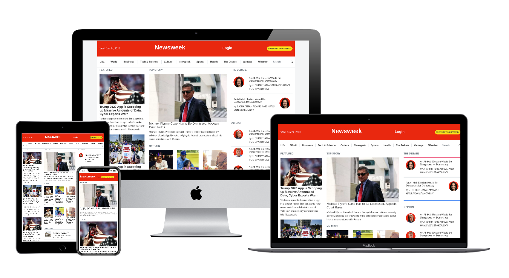

# Newsweek Clone.

> This is a clone of the Newsweek using bootstrap page.

This is a replica of the newsweek page. the clone has been done through responsive techonologis, bootstrap. It supports different screen sizes.

## Built With

- HTML5,
- CSS3.
- SASS
- Boostrap

## Live Demo

To see a preview of the actual project, check out the [Live Demo Link](https://raw.githack.com/berhanu-tarekegn/news-week-bootstrap/develop/index.html)

## Getting Started

To get a local copy up and running follow these simple example steps.

### Prerequisites
To run the project smoothly, you must have the following installed on your machine:

- Git
- A web browser.

### Setup

- You need to clone the project by running `git clone https://github.com/berhanu-tarekegn/news-week-bootstrap.git` 
- Generate the css from the **SASS** uisng the following command `sass assets/css/main.scss assets/css/main.css` assuming you're on the root directory of the project
-You'd then navigate to the location to which you cloned the project and run the `index.html` file on your browser.

## Authors

👤 **Berhanu Tarekegn**

- Github: [@BerhanuTarekegn](https://github.com/berhanu-tarekegn)
- Linkedin: [Berhanu Tarekegn](https://www.linkedin.com/in/berhanu-tarekegn-687367123/)

## 🤝 Contributing

Contributions, issues and feature requests are welcome!

Feel free to check the [issues page](issues/).

## Show your support

Give a ⭐️ if you like this project!

## Acknowledgments

- W3Schools
- CSS Tricks
- miniskin team

## 📝 License

This project is [MIT](lic.url) licensed.
